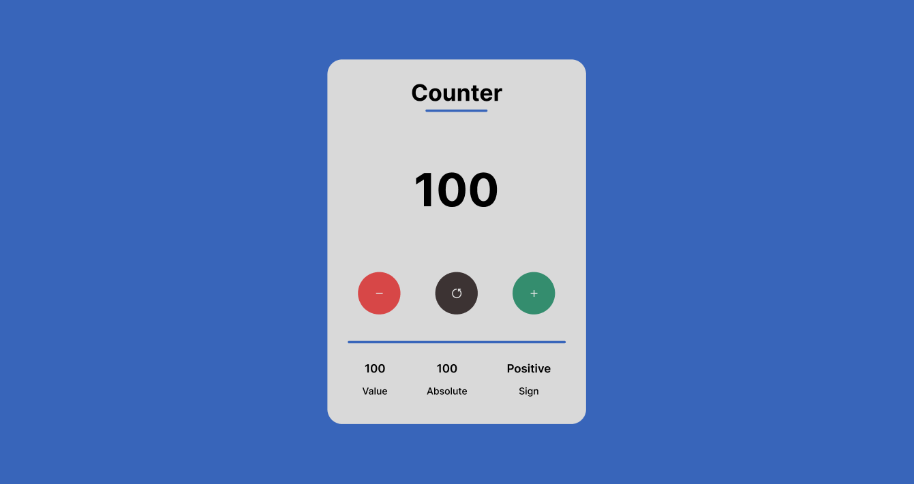

# Counter App

A simple React counter application with increment, decrement, and reset functionality. The app displays the current value, its absolute value, and whether the value is positive or negative.

## Screenshot



## Features

- Increment and decrement the counter
- Reset to zero
- Shows absolute value and sign

## Getting Started

1. Clone the repository:
    ```
    git clone https://github.com/your-username/your-repo.git
    cd your-repo
    ```
2. Install dependencies:
    ```
    npm install
    ```
3. Start the development server:
    ```
    npm start
    ```

## Deployment

You can deploy this app to Netlify or Vercel. No need to upload `node_modules`—just push your code and connect your repo.

## License MIT
